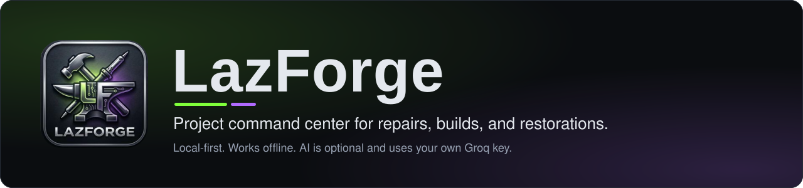
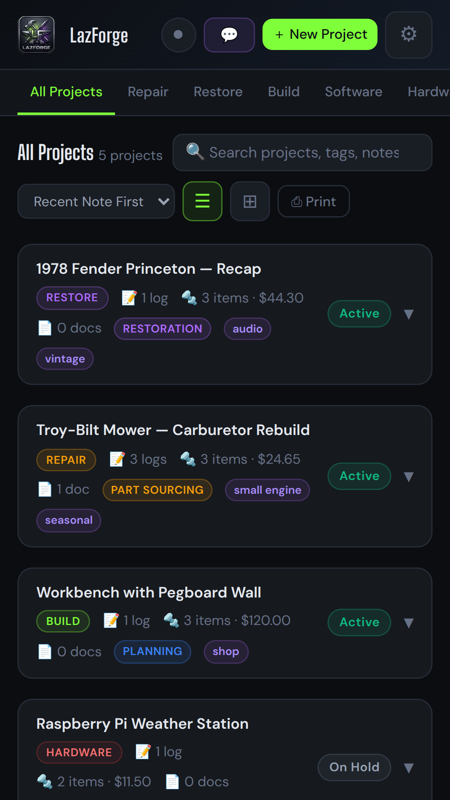
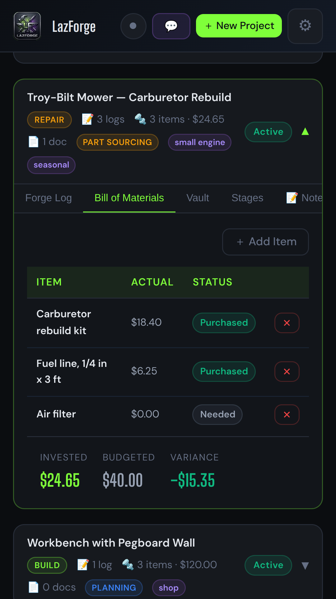
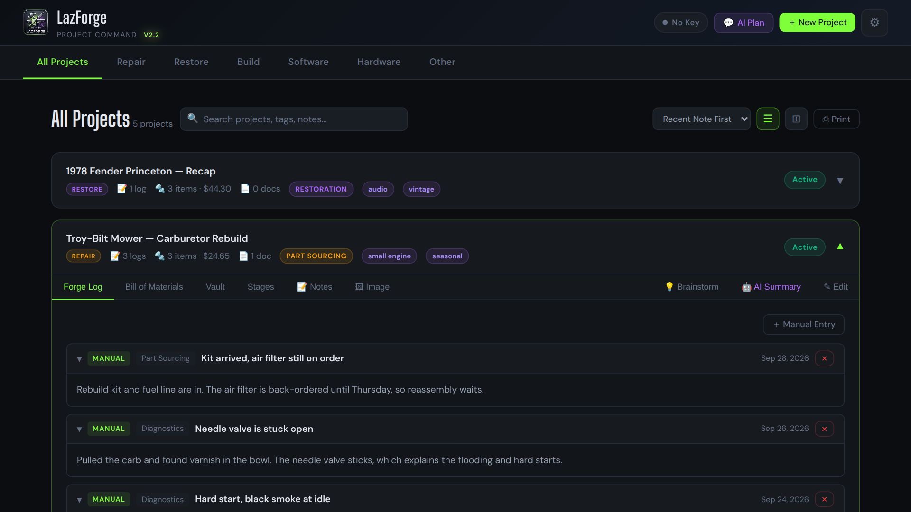
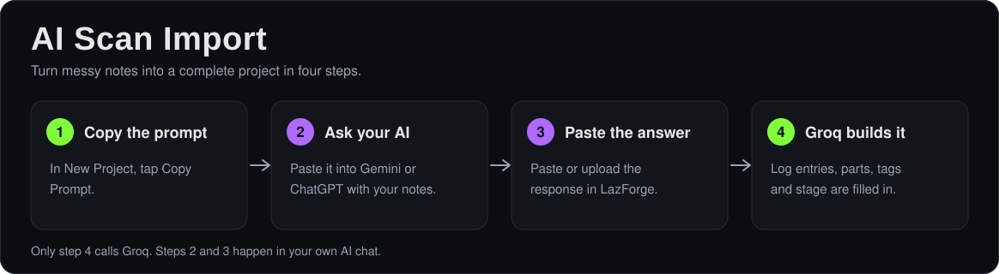
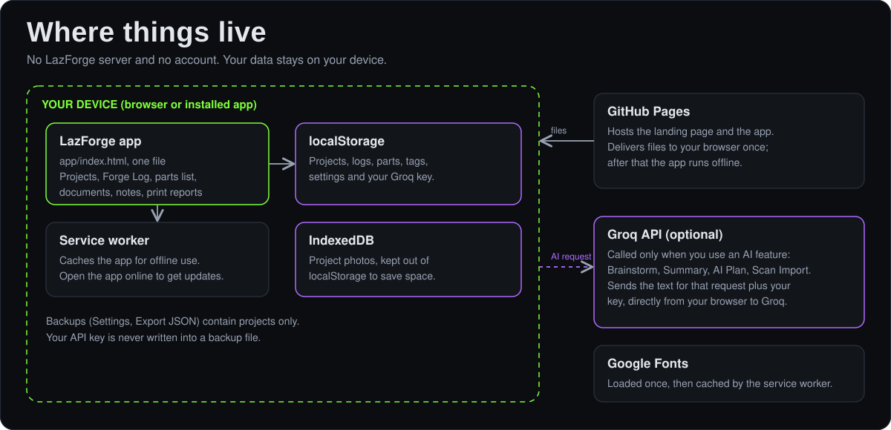

<p align="center">
  
</p>

# LazForge

LazForge is a project command center for repairs, builds, restorations, and software or hardware projects. Each project gets a Forge Log, a parts list that compares what you spent with what you budgeted, linked documents, notes, and stage tracking. AI is optional: if you add your own Groq key, you can brainstorm, summarize a project, and turn messy notes into a full project.

It is a single-file progressive web app. It installs to a phone or desktop, works offline, and keeps your data on your device. There is no LazForge server and no account.

<p align="center">
  
  
  
</p>

## Live

| | URL |
|---|---|
| Landing page | https://johnlaz.github.io/forgeapp/ |
| App | https://johnlaz.github.io/forgeapp/app/ |
| Repo | https://github.com/johnlaz/forgeapp |

To install, open the app in Chrome, Edge, or Safari and use the browser's install option (Add to Home Screen on iOS).

## Features

- Five project templates (Repair, Restore, Build, Software, Hardware) plus custom labels
- Forge Log with collapsible entries, marked as manual or AI
- Bill of materials with actual versus budget variance
- Document vault for links to PDFs and manuals
- Tags, a scratch pad per project, and full-text search
- Grid and stack views, and a print selector for choosing which projects to print
- AI Brainstorm, with **Forge to Log** to save what you want to keep
- AI Project Summary with copy and print
- AI Scan Import: paste a Gemini or ChatGPT answer and Groq builds the project
- Light and dark mode

<p align="center">
  
</p>

## Repo layout

```
/index.html           landing page
/README.md            this file
/docs/                README diagrams (SVG only)
/app/index.html       the app (single file)
/app/manifest.json    PWA manifest
/app/sw.js            service worker
/app/icon-192.png     app icon (maskable-safe)
/app/icon-512.png     app icon (maskable-safe)
/app/shot-*.png       screenshots used by the manifest and landing page
```

<p align="center">
  
</p>

## AI and model setup

LazForge uses Groq only.

1. Get a free key at [console.groq.com/keys](https://console.groq.com/keys).
2. Open the app, then Settings (gear), paste the key, and tap Save.
3. Tap the activity light in the header to test the connection. It turns green when the key works.

**Model picker.** The built-in models (Qwen 3.6 27B, Llama 3.3 70B, GPT-OSS 120B, Llama 3.1 8B) stay in the list. When you save a key, and whenever you tap the refresh button next to the picker, LazForge asks Groq which chat models your key can use and adds any new ones under "From your Groq account". It never removes a model or changes your selection. If your saved model is no longer on Groq's list, it is kept and marked "not in current list".

**Reasoning setting.** Groq models handle `reasoning_effort` differently, so LazForge sends it only where it is supported: `none` for Qwen models and `low` for GPT-OSS. Other models get no reasoning parameter.

AI features need an internet connection and a web address (`https://` or `localhost`). They do not work from a `file://` page.

## Data and privacy

- Projects, logs, parts, tags, and settings are stored in your browser's `localStorage`. Project photos are stored in IndexedDB.
- Nothing is sent anywhere except when you use an AI feature. Then the text for that request goes from your browser straight to Groq, along with your key.
- **Export JSON Backup** (Settings) writes your projects to a file. It does not include your API key. **Import JSON Backup** adds projects that are not already in your library and never overwrites existing ones.
- Clearing your browser's site data deletes everything, so export a backup now and then.
- Two sample projects are added on first launch. They carry a "Sample" tag, and Settings has **Remove Sample Projects**.

## Deploy and update

Hosting is GitHub Pages from the `main` branch, root folder.

1. Push the repo layout above to `main`.
2. In the repo, go to Settings, Pages, and set the source to `main` and `/ (root)`.
3. The landing page is at the site root and the app is at `/app/`.

**Releasing a change**

1. Edit `app/index.html` (or other files).
2. Bump `APP_VERSION` near the top of the app script. That one value sets the visible version stamp and the service worker cache name, so a new version always gets a fresh cache.
3. Update the version text in the landing page footer and nav by hand.
4. Commit and push.

The service worker fetches HTML from the network first, so a new deploy appears the next time the app opens online. Installed copies show a "new version ready" banner with a Reload button. If you change the file list, update `PRECACHE` in `app/sw.js`.

**Local development**

```bash
python3 -m http.server 8080    # or: npx serve .
```

Open `http://localhost:8080/app/`. Serving over HTTP is required for AI calls and the service worker.

## Changelog

**v2.2**
- New look that matches the logo: lime and violet on gunmetal, with Big Shoulders Display headings.
- Model picker can refresh from Groq; `reasoning_effort` is sent only to models that support it.
- JSON backups no longer contain the Groq API key.
- Service worker: network-first HTML, cached fonts, update banner. Cache name now follows `APP_VERSION`.
- Manifest: relative scope, `id`, separate maskable icons, and screenshots. Icon set reduced to 192 and 512.
- Page weight cut from about 1.4 MB to 250 KB (app) and 1.1 MB to 25 KB (landing) by removing duplicate embedded logos.
- Sample projects are tagged and removable.
- Accessibility: dialog roles, named controls, keyboard-operable cards, focus outlines, reduced motion.
- Removed the Android APK download from the landing page.

**v2.0**
- Groq only (Gemini dropped). Declared stable.

---

© 2026 LAZLAB Creations. All Rights Reserved. lazlab.io@gmail.com
